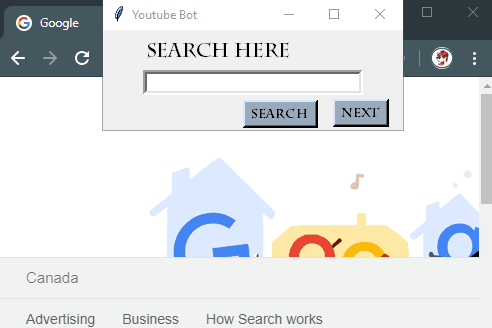

#Youtube Bot
* This application is made to search youtube videos in an instant second and to make your searching easier.  
* Search video on the application and it takes you directly to the video. Moreover you can change videos by "Next" button. It reduces time required to surf the website and find the video. 

* The project is built in 3 modules: 
  1. Logs.py 
  2. User.py 
  3. HTMLScrapping.py 
 
* Application is run using User.py 

* Future goals: 
  Make it multi functional. 
  Contributions are happily accepted. 

* Here is how it works: 
  
  
